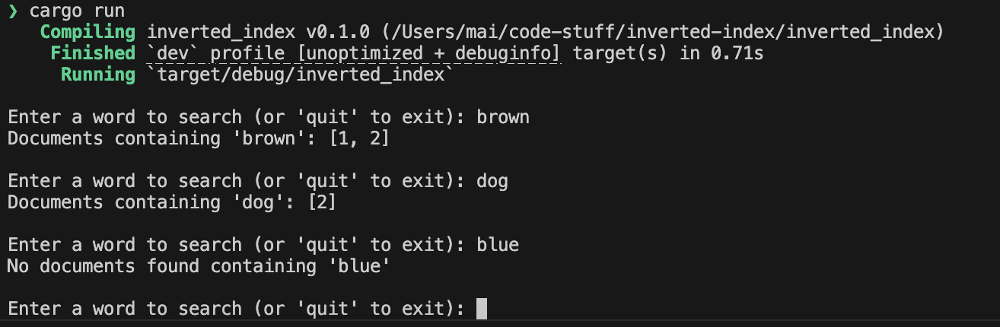

# inverted-index

inverted index algorithm implemented in rust. This is my first rust program. Expect lot's of comment. I'm documenting my learning. 

## Setup 

```
cargo run
```

### Test

```
cargo test
```

## Version 0

GOAL: get a inverted index up and running



## Version 1

GOAL: Create an exportable python package

